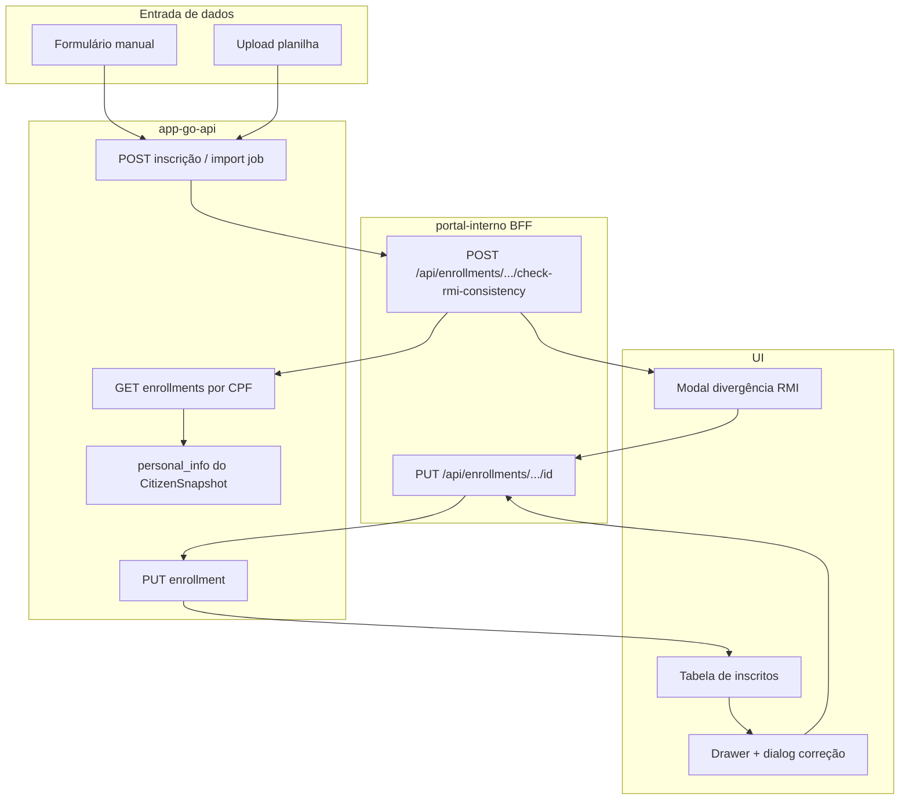
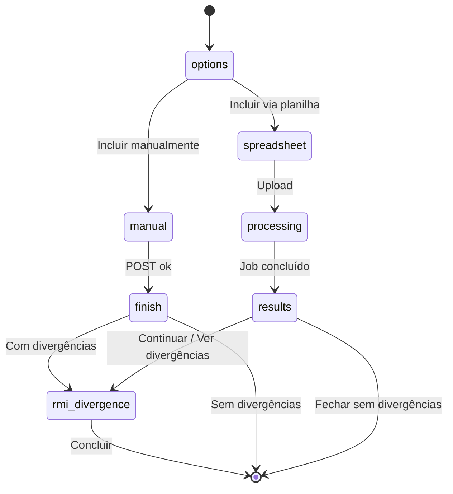
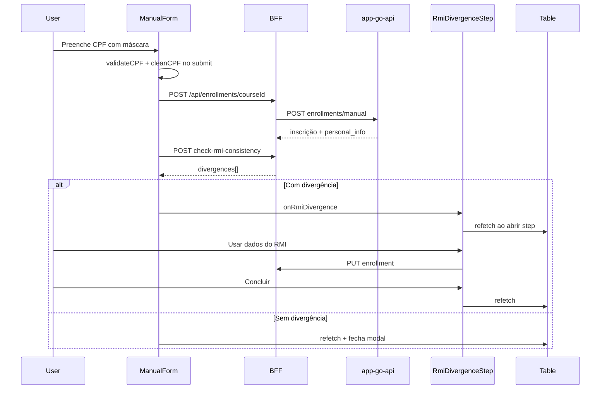
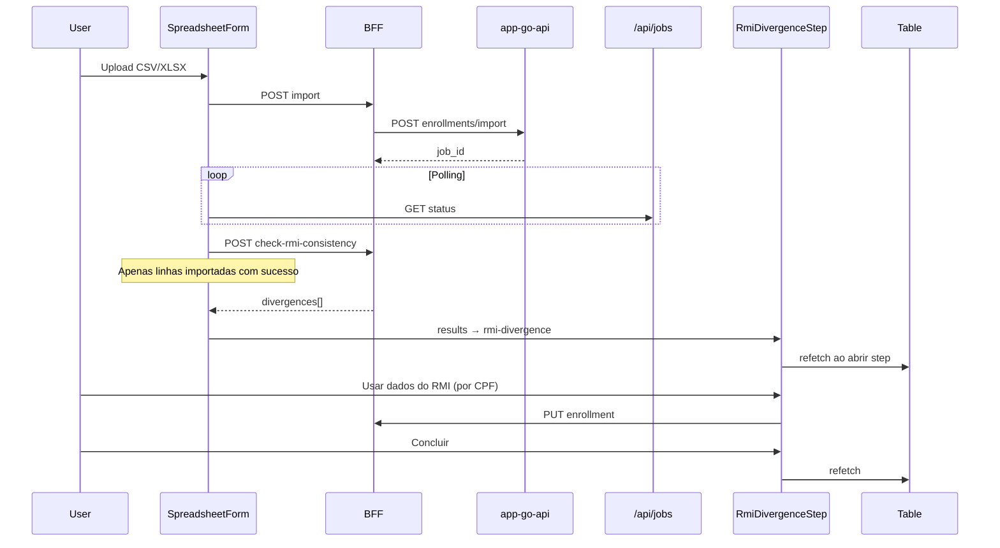

# Validação de consistência RMI em inscrições de cursos

Documentação da feature de **validação e correção de divergências** entre dados informados na inscrição e os dados oficiais do **Registro Municipal Integrado (RMI)**, no módulo **Oportunidades Cariocas → Cursos** do portal-interno.

---

## Visão geral

Quando um participante é inscrito manualmente ou via planilha, o sistema compara os dados declarados (nome, telefone, e-mail) com o `personal_info` retornado pelo **app-go-api** (snapshot do cidadão no RMI). Se houver diferença, a inscrição é criada normalmente, mas o operador é alertado e pode sincronizar os campos com os dados oficiais via PUT.

A comparação **não inclui** endereço, bairro ou idade — apenas campos para os quais a sincronização via PUT é confiável.



---

## Campos comparados

| Campo na inscrição | Campo no RMI (`personal_info`) | Regra de comparação |
|---|---|---|
| `name` (declarado) | `nome` | Normalização de acentos e caixa (`normalizeString`) |
| `phone` | `celular` | Apenas dígitos; remove prefixo `55` se presente; compara últimos 11 dígitos |
| `email` | `email` | Lowercase; ignora placeholders inválidos (`naotem@email.com`, `0@0.aa`) |

Se **qualquer um** dos lados estiver vazio (ou e-mail inválido), aquele campo **não gera divergência** — comparação considerada OK para aquele par.

### Campos excluídos da comparação

Endereço, bairro e idade foram removidos da lógica de divergência porque o PUT nesses campos não era confiável o suficiente para sincronização automática com o RMI.

---

## Modelo de dados no frontend

O tipo `Enrollment` (`src/types/course.ts`) foi estendido para distinguir dados declarados vs. exibidos:

| Propriedade | Origem API | Uso |
|---|---|---|
| `candidateName` | `personal_info.nome` ou `name` | Nome exibido na tabela |
| `declaredName` | `apiEnrollment.name` | Valor informado na inscrição; usado na comparação RMI |
| `email` | RMI ou enrollment | E-mail exibido (prioriza RMI válido) |
| `declaredEmail` | `apiEnrollment.email` | E-mail declarado; usado na comparação RMI |
| `phone` | `apiEnrollment.phone` | Telefone da inscrição |
| `personal_info` | Snapshot RMI | Fonte dos dados oficiais |

A detecção persistente na listagem usa `getEnrollmentRmiDivergence(enrollment)`, que compara `declaredName`, `declaredEmail` e `phone` contra `personal_info`.

---

## Endpoints BFF (Next.js)

Todos os handlers ficam em `src/app/api/enrollments/` e delegam ao cliente Orval `http-gorio`.

### POST `/api/enrollments/[course-id]` — Inscrição manual

Cria um participante via `postApiV1CoursesCourseIdEnrollmentsManual`.

**Body (campos obrigatórios):** `name`, `cpf` (11 dígitos), `age`, `phone`, `address`, `neighborhood`  
**Opcionais:** `email`, `schedule_id`, `custom_fields`

**Resposta:** enrollment convertido com `unwrapApiInscricao` + `convertApiEnrollmentToFrontend`.

---

### POST `/api/enrollments/[course-id]/import` — Importação por planilha

Envia arquivo `.csv` ou `.xlsx` (multipart) para `postApiV1CoursesCourseIdEnrollmentsImport`.

**Resposta:** `202` com `job_id` para polling em `/api/jobs/[job-id]/status`.

---

### POST `/api/enrollments/[course-id]/check-rmi-consistency` — Verificação em lote

Compara entradas submetidas com inscrições já criadas no curso.

**Request:**

```json
{
  "entries": [
    {
      "cpf": "12345678909",
      "name": "João Silva",
      "phone": "21999999999",
      "email": "joao@email.com",
      "line": 2
    }
  ]
}
```

**Fluxo interno:**

1. Para cada CPF único (11 dígitos), busca inscrição via `getApiV1CoursesCourseIdEnrollments` com `search=cpf`
2. Executa `compareEnrollmentWithRmi(entry, enrollment.personal_info, enrollment.id)`
3. Retorna apenas entradas com divergência

**Response:**

```json
{
  "divergences": [
    {
      "enrollmentId": "uuid",
      "cpf": "12345678909",
      "line": 2,
      "divergences": [
        { "field": "name", "label": "Nome", "submitted": "...", "rmi": "..." }
      ],
      "submittedData": { ... },
      "rmiData": { "name": "...", "phone": "...", "email": "..." }
    }
  ]
}
```

---

### PUT `/api/enrollments/[course-id]/[enrollment-id]` — Sincronizar com RMI

Atualiza campos da inscrição via `putApiV1CoursesCourseIdEnrollmentsEnrollmentId`.

**Body (pelo menos um campo):** `name`, `phone`, `email`, `address`, `neighborhood`, `age`

No fluxo RMI, o payload é montado por `mapRmiToEnrollmentUpdate(rmiData)` — apenas `name`, `phone` e `email` quando presentes no RMI.

**Resposta:** enrollment atualizado convertido para o formato frontend.

---

## Biblioteca central

**Arquivo:** `src/lib/enrollment-rmi-consistency.ts`

| Função | Descrição |
|---|---|
| `compareEnrollmentWithRmi()` | Compara dados submetidos vs. `personal_info`; retorna `EnrollmentRmiDivergence` ou `null` |
| `fetchEnrollmentRmiDivergences()` | Chama o BFF de check em lote |
| `getEnrollmentRmiDivergence()` | Divergência a partir de um `Enrollment` já carregado |
| `hasEnrollmentRmiDivergence()` | Boolean para badge/indicadores |
| `mapRmiToEnrollmentUpdate()` | Monta payload PUT com dados oficiais |
| `extractRmiDisplayValues()` | Extrai `nome`, `celular`, `email` do snapshot RMI |
| `normalizePhoneForComparison()` | Normalização de telefone para comparação |

**Conversores:** `src/lib/enrollment-converters.ts`

- `unwrapApiInscricao()` — desempacota respostas `{ data: ... }` do app-go-api
- `convertApiEnrollmentToFrontend()` — popula `declaredName`, `declaredEmail`, `candidateName`, etc.

**CPF (formulário manual):** `src/lib/cpf-validator.ts`

- `formatCPF()` — máscara `XXX.XXX.XXX-XX` no input
- `validateCPF()` — dígitos verificadores + sequências inválidas
- `cleanCPF()` — envia apenas 11 dígitos na API

---

## Fluxos de UI

### Modal — Adicionar participantes

**Componentes:** `src/app/(private)/(app)/gorio/components/add-participants/`

**Steps do modal:**



**Hook de estado:** `src/hooks/use-add-participants-modal.ts`

| Momento | Ação `onSuccess` (refetch da tabela) |
|---|---|
| Entrada no step `rmi-divergence` | Sim — mostra inscritos recém-criados |
| Step `results` ou `finish` success ao fechar modal | Sim |
| Step `rmi-divergence` ao clicar **Concluir** | Sim — atualiza após sync com RMI |
| Step `rmi-divergence` ao fechar (X / overlay) | Sim |
| Inscrição manual sem divergência (auto-close) | Sim |

---

### Fluxo manual



---

### Fluxo planilha



#### Colunas da planilha

| Coluna | Obrigatória | Observação |
|---|---|---|
| `nome_completo` | Sim | |
| `cpf` | Sim | Com ou sem máscara; 11 dígitos |
| `idade` | Não | |
| `telefone` | Não | |
| `email` | Não | |
| `endereco` | Não | |
| `bairro` | Não | |
| `Turma` | Condicional | Obrigatória se o curso tem múltiplas turmas (UUID da turma) |
| *(custom fields)* | Condicional | Título do campo personalizado do curso |

Formatos: `.csv`, `.xlsx` — máximo 10 MB.

---

### Step de divergência RMI

**Arquivos:**

- `rmi-divergence-step.tsx` — lista de itens + banner amber + botão Concluir
- `rmi-divergence-item.tsx` — comparação lado a lado + botão **Usar dados do RMI**

**Comportamento do item:**

1. Exibe dados informados vs. dados oficiais do RMI
2. Campos inferiores (nome, telefone, e-mail) ficam **disabled** com valores RMI
3. **Usar dados do RMI** → PUT com `mapRmiToEnrollmentUpdate` → item fica verde ("dados sincronizados")
4. Banner amber some quando `pendingCount === 0`

**Botão Concluir:**

- Sem pendências: label **Concluir**
- Com pendências: **Continuar sem alterar (N pendente(s))**

---

### Listagem persistente

**Arquivo:** `src/app/(private)/(app)/gorio/components/enrollments-table.tsx`

| Elemento | Componente | Comportamento |
|---|---|---|
| Coluna Candidato | `RmiDivergenceBadge` | Ícone `AlertTriangle` amber + tooltip |
| Drawer (detalhes) | Banner amber | Lista campos divergentes + CTA **Corrigir divergências com o RMI** |
| Dialog correção | `EnrollmentRmiCorrectionDialog` | Reutiliza `RmiDivergenceItem`; refetch após sync |

O badge desaparece quando, após refetch, `hasEnrollmentRmiDivergence(enrollment)` retorna `false` — ou seja, quando os dados declarados na inscrição passam a coincidir com o RMI (tipicamente após PUT de sincronização).

---

## Mapa de arquivos

```
src/
├── app/
│   ├── api/enrollments/[course-id]/
│   │   ├── route.ts                          # GET list, POST manual
│   │   ├── import/route.ts                   # POST planilha
│   │   ├── check-rmi-consistency/route.ts    # POST verificação RMI
│   │   └── [enrollment-id]/route.ts          # PUT atualização
│   └── (private)/(app)/gorio/components/
│       ├── add-participants/
│       │   ├── add-participants-modal.tsx
│       │   ├── manual-form.tsx
│       │   ├── spreadsheet-form.tsx
│       │   ├── rmi-divergence-step.tsx
│       │   ├── rmi-divergence-item.tsx
│       │   └── results-step.tsx
│       ├── enrollments-table.tsx
│       ├── enrollment-rmi-correction-dialog.tsx
│       └── rmi-divergence-badge.tsx
├── hooks/
│   └── use-add-participants-modal.ts
├── lib/
│   ├── enrollment-rmi-consistency.ts         # Lógica de comparação
│   ├── enrollment-converters.ts              # API → frontend + declared fields
│   └── cpf-validator.ts                      # Máscara/validação CPF manual
└── types/
    └── course.ts                             # Enrollment + declaredName/declaredEmail
```

---

## Integração com app-go-api

| Operação portal-interno | Cliente Orval | Endpoint Go |
|---|---|---|
| Criar inscrição manual | `postApiV1CoursesCourseIdEnrollmentsManual` | `POST /api/v1/courses/{id}/enrollments/manual` |
| Importar planilha | `postApiV1CoursesCourseIdEnrollmentsImport` | `POST /api/v1/courses/{id}/enrollments/import` |
| Listar inscrições (busca CPF) | `getApiV1CoursesCourseIdEnrollments` | `GET /api/v1/courses/{id}/enrollments` |
| Atualizar inscrição | `putApiV1CoursesCourseIdEnrollmentsEnrollmentId` | `PUT /api/v1/courses/{id}/enrollments/{enrollmentId}` |

O `personal_info` vem do **CitizenSnapshot** sincronizado pelo app-go-api a partir do **app-rmi**. Não há chamada direta ao app-rmi a partir do portal-interno neste fluxo.

---

## Decisões de produto e limitações

1. **Inscrição sempre é criada** — divergência RMI não bloqueia a criação; é um alerta pós-submissão.
2. **Sincronização é opt-in** — operador escolhe **Usar dados do RMI** ou **Continuar sem alterar**.
3. **Comparação restrita** — apenas nome, telefone e e-mail; endereço/bairro/idade fora do escopo.
4. **E-mails placeholder** — endereços como `naotem@email.com` são ignorados na comparação.
5. **CPF manual** — máscara visual; API recebe só dígitos; validação de dígitos verificadores no formulário.
6. **Indicador na tabela** — calculado client-side a cada render/refetch; depende de `declaredName`/`declaredEmail`/`phone` + `personal_info` estarem presentes na resposta da listagem.

---

## Testes manuais sugeridos

### Inscrição manual com divergência

1. Inscrever CPF existente no RMI com nome/telefone/e-mail diferentes dos oficiais
2. Confirmar modal de divergência após sucesso
3. Clicar **Usar dados do RMI** → item verde
4. Clicar **Concluir** → tabela atualiza sem refresh; ícone amber some

### Planilha com divergência

1. Importar planilha com CPFs que gerem divergência
2. Em **Resultado**, clicar **Continuar** ou **Ver divergências com o RMI**
3. Sincronizar cada item e **Concluir**
4. Confirmar refetch e remoção dos ícones

### Correção pelo drawer

1. Abrir inscrição com ícone amber na tabela
2. Clicar **Corrigir divergências com o RMI** no drawer
3. Sincronizar no dialog
4. Confirmar refetch e fechamento do dialog

### Fechamento do modal sem concluir

1. Abrir step de divergência, sincronizar um item
2. Fechar modal pelo X ou clique fora
3. Confirmar que a tabela reflete o sync (refetch no fechamento)

### CPF inválido (manual)

1. Tentar submeter CPF com dígitos verificadores inválidos ou sequência repetida (111.111.111-11)
2. Confirmar erro de validação no campo antes do POST

---

## Referências

- [API Integration](./API_INTEGRATION.md) — padrão BFF → Orval → app-go-api
- [gorio-multiple-schedules-migration](./gorio-multiple-schedules-migration.md) — turmas e `schedule_id`
- app-go-api: `internal/jobs/enrollment_import_job.go` — parser e validação de planilha no backend
