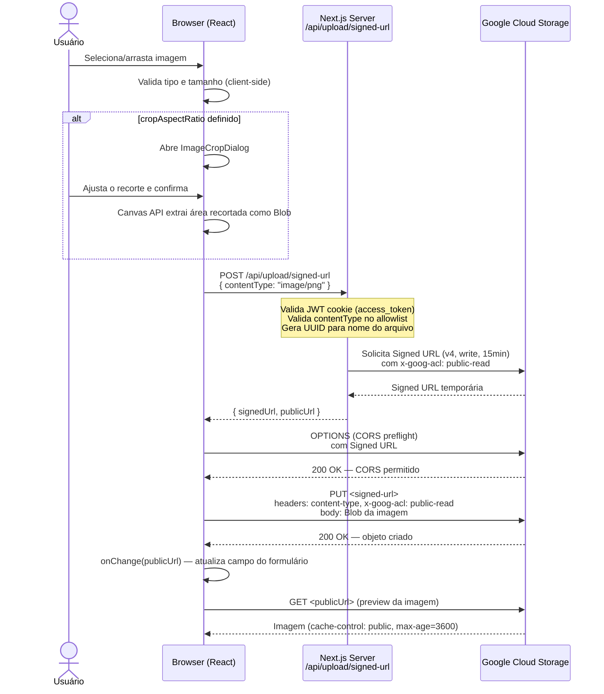
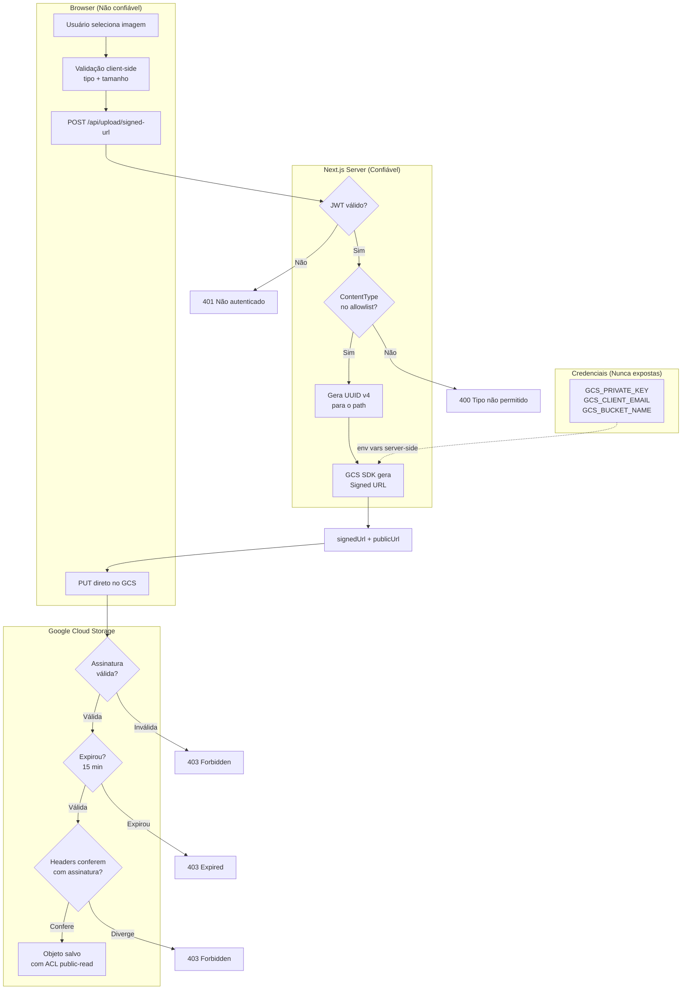
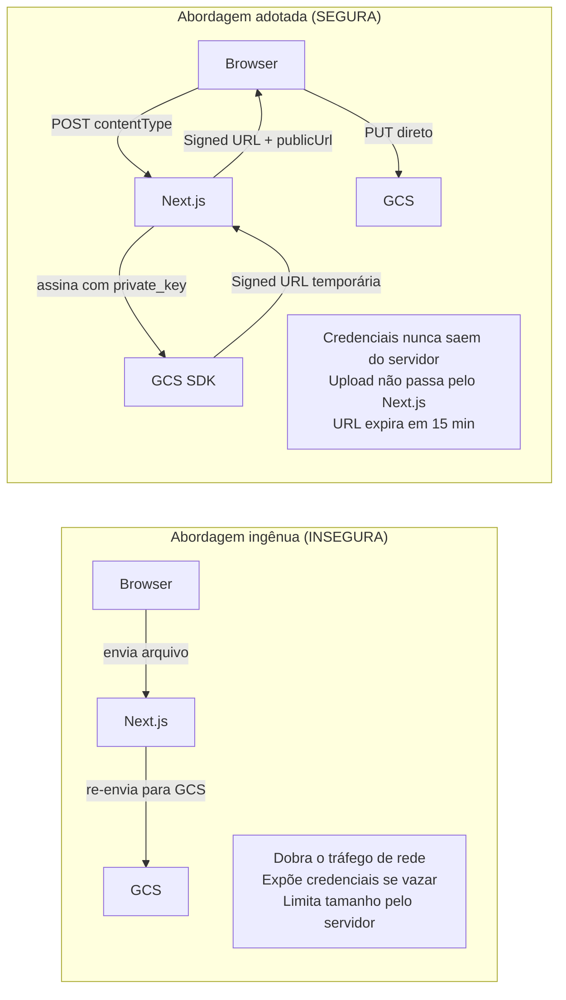
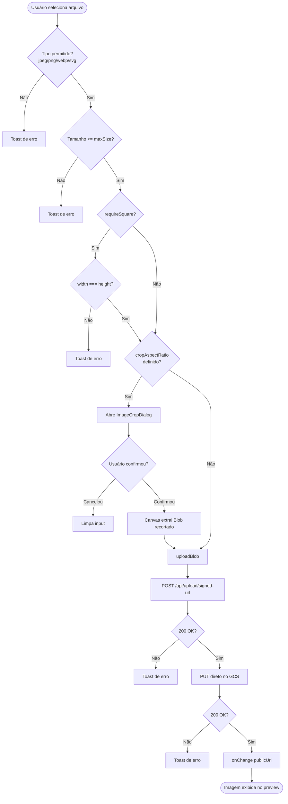
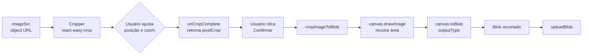

# Upload de Imagens via Google Cloud Storage (Signed URLs)

## Visão Geral

Esta feature implementa upload seguro de imagens diretamente para o Google Cloud Storage (GCS) sem que os arquivos passem pelo servidor Next.js. O padrão utilizado é chamado de **presigned/signed URL** — o servidor gera uma URL temporária e assinada criptograficamente que autoriza o browser a fazer o upload diretamente para o bucket GCS.

**Arquivos envolvidos:**

- `[src/app/api/upload/signed-url/route.ts](../src/app/api/upload/signed-url/route.ts)` — API Route que gera a Signed URL
- `[src/components/ui/image-upload.tsx](../src/components/ui/image-upload.tsx)` — Componente de upload reutilizável
- `[src/components/ui/image-crop-dialog.tsx](../src/components/ui/image-crop-dialog.tsx)` — Dialog de recorte de imagem
- Uso: `new-course-form.tsx` nos campos `institutional_logo`, `cover_image` e `external_partner_logo_url`

**Dependências adicionadas:**

- `@google-cloud/storage` ^7.21.0 — SDK oficial do GCS para geração de Signed URLs
- `react-easy-crop` ^6.0.2 — Componente de recorte de imagem no browser

---

## Fluxo Completo de Upload




---

## Anatomia das Requisições de Rede

O upload gera **4 requisições** em sequência:

### 1. POST `/api/upload/signed-url` (Next.js — same-origin)

```
URL:    root/api/upload/signed-url
Método: POST
Body:   { "contentType": "image/png" }
Auth:   Cookie: access_token=<JWT>
```

Resposta:

```json
{
  "signedUrl": "https://storage.googleapis.com/rj-superapp-staging-prefrio/superapp/images/courses/<uuid>.png?X-Goog-Algorithm=GOOG4-RSA-SHA256&X-Goog-Credential=...&X-Goog-Date=...&X-Goog-Expires=900&X-Goog-SignedHeaders=content-type%3Bhost%3Bx-goog-acl&X-Goog-Signature=...",
  "publicUrl": "https://storage.googleapis.com/rj-superapp-staging-prefrio/superapp/images/courses/<uuid>.png"
}
```

> `X-Goog-Expires=900` = 900 segundos = **15 minutos** de validade.

### 2. OPTIONS (CORS Preflight — cross-site)

O browser envia o preflight automaticamente antes de qualquer PUT cross-origin:

```
URL:    https://storage.googleapis.com/...<signed-url>
Método: OPTIONS
Access-Control-Request-Method:  PUT
Access-Control-Request-Headers: content-type, x-goog-acl
```

Resposta do GCS:

```
access-control-allow-origin:  http://localhost:3000
access-control-allow-methods: PUT
access-control-allow-headers: Content-Type, x-goog-acl
access-control-max-age:       3600
```

### 3. PUT (upload direto para o GCS — cross-site)

```
URL:    https://storage.googleapis.com/...<signed-url>
Método: PUT
Headers:
  Content-Type: image/png
  x-goog-acl:   public-read
Body:   <Blob da imagem, 1.013.322 bytes>
```

Resposta:

```
Status: 200 OK
ETag:   "59f7b5c3e01c5c9a9d6def8b615bb63c"
x-goog-generation: 1781293506922524
```

> O header `x-goog-acl: public-read` está incluído em `X-Goog-SignedHeaders`, o que significa que o GCS **verifica** que o browser deve enviar exatamente esse header — qualquer alteração invalida a assinatura.

### 4. GET (preview da imagem — cross-site)

```
URL:    https://storage.googleapis.com/rj-superapp-staging-prefrio/superapp/images/courses/<uuid>.png
Método: GET
```

Resposta:

```
Status: 200 OK
cache-control: public, max-age=3600
content-type:  image/png
```

---

## Arquitetura de Segurança




### Camadas de proteção


| Camada                       | Mecanismo                                                                                | Onde                  |
| ---------------------------- | ---------------------------------------------------------------------------------------- | --------------------- |
| **Autenticação**             | JWT no cookie `access_token` validado antes de emitir qualquer URL                       | `route.ts` — servidor |
| **Allowlist de tipos**       | Apenas `image/jpeg`, `image/png`, `image/webp`, `image/svg+xml`                          | `route.ts` — servidor |
| **Isolamento de path**       | Nome do arquivo gerado por `crypto.randomUUID()` — usuário não controla                  | `route.ts` — servidor |
| **Assinatura criptográfica** | RSA-SHA256 (GOOG4) — qualquer alteração na URL ou headers invalida o upload              | GCS                   |
| **Expiração**                | Signed URL válida por apenas 15 minutos                                                  | GCS                   |
| **Headers fixos**            | `X-Goog-SignedHeaders` inclui `content-type` e `x-goog-acl` — GCS verifica               | GCS                   |
| **ACL por objeto**           | `x-goog-acl: public-read` torna o objeto público individualmente, **sem expor o bucket** | GCS                   |
| **Validação client-side**    | Tipo e tamanho verificados antes de qualquer requisição (UX, não segurança)              | Browser               |
| **Validação de URL no form** | Zod exige que URLs de imagem comecem com `https://storage.googleapis.com/`               | `new-course-form.tsx` |


### Por que as credenciais nunca chegam ao browser?

O padrão Signed URL resolve o problema clássico de upload seguro:




---

## Detalhes da Signed URL (GOOG4-RSA-SHA256)

A Signed URL gerada contém os seguintes parâmetros na query string:


| Parâmetro              | Valor                                                                                                  | Significado                                                     |
| ---------------------- | ------------------------------------------------------------------------------------------------------ | --------------------------------------------------------------- |
| `X-Goog-Algorithm`     | `GOOG4-RSA-SHA256`                                                                                     | Algoritmo de assinatura (RSA com SHA-256)                       |
| `X-Goog-Credential`    | `prefrio-media-upload@rj-superapp-staging.iam.gserviceaccount.com/20260612/auto/storage/goog4_request` | Service account + data + escopo                                 |
| `X-Goog-Date`          | `20260612T194504Z`                                                                                     | Timestamp UTC da criação                                        |
| `X-Goog-Expires`       | `900`                                                                                                  | TTL em segundos (15 minutos)                                    |
| `X-Goog-SignedHeaders` | `content-type;host;x-goog-acl`                                                                         | Headers que o browser **deve** enviar exatamente como assinados |
| `X-Goog-Signature`     | `68815da6...`                                                                                          | Assinatura RSA do payload completo                              |


O path do objeto no bucket segue a estrutura:

```
superapp/images/courses/<uuid-v4>.<ext>
```

Exemplo: `superapp/images/courses/6482de95-8307-4f59-9065-88afb3b4bbff.png`

---

## Componente `ImageUpload`

### Props


| Prop              | Tipo                                | Padrão  | Descrição                                                                   |
| ----------------- | ----------------------------------- | ------- | --------------------------------------------------------------------------- |
| `value`           | `string | null`                     | —       | URL atual da imagem                                                         |
| `onChange`        | `(url: string | undefined) => void` | —       | Callback com a URL pública após upload                                      |
| `label`           | `string`                            | —       | Label do campo                                                              |
| `maxSize`         | `number`                            | `1MB`   | Tamanho máximo em bytes                                                     |
| `requireSquare`   | `boolean`                           | `false` | Rejeita imagens não quadradas                                               |
| `cropAspectRatio` | `number`                            | —       | Se definido, abre dialog de recorte com esse aspect ratio (ex: `16/9`, `1`) |
| `defaultValue`    | `string`                            | —       | Exibe botão "Restaurar padrão" quando vazio                                 |
| `disabled`        | `boolean`                           | `false` | Desabilita interações                                                       |


### Fluxo interno do componente




### Uso no formulário de cursos

```tsx
// Logo institucional — com valor padrão e sem crop
<ImageUpload
  value={field.value}
  onChange={field.onChange}
  label="Logo institucional *"
  defaultValue={DEFAULT_INSTITUTIONAL_LOGO_URL}
/>

// Imagem de capa — com crop widescreen 16:9
<ImageUpload
  value={field.value}
  onChange={field.onChange}
  label="Imagem de capa *"
  cropAspectRatio={16 / 9}
/>
```

---

## Componente `ImageCropDialog`

Utiliza `react-easy-crop` para permitir que o usuário ajuste o recorte antes do upload. O processamento ocorre inteiramente no browser via **Canvas API** — nenhum dado extra trafega pelo servidor.




**Props principais:**


| Prop         | Tipo                                        | Descrição                      |
| ------------ | ------------------------------------------- | ------------------------------ |
| `aspect`     | `number`                                    | Proporção travada (ex: `16/9`) |
| `outputType` | `'image/jpeg' | 'image/png' | 'image/webp'` | Formato de saída               |
| `onConfirm`  | `(blob: Blob) => void`                      | Callback com imagem recortada  |


> SVG é convertido para PNG ao entrar no dialog de recorte, pois o Canvas não exporta SVG como Blob de imagem.

---

## Variáveis de Ambiente Necessárias


| Variável           | Descrição                                                                                         |
| ------------------ | ------------------------------------------------------------------------------------------------- |
| `GCS_BUCKET_NAME`  | Nome do bucket GCS (ex: `rj-superapp-staging-prefrio`)                                            |
| `GCS_CLIENT_EMAIL` | Email da service account (ex: `prefrio-media-upload@rj-superapp-staging.iam.gserviceaccount.com`) |
| `GCS_PRIVATE_KEY`  | Chave privada RSA da service account (com `\n` escapado)                                          |


Todas são **server-side only** (sem prefixo `NEXT_PUBLIC_`) e nunca chegam ao browser.

### Permissões necessárias na service account


| Permissão IAM                  | Motivo                        |
| ------------------------------ | ----------------------------- |
| `storage.objects.create`       | Criar novos objetos no bucket |
| `storage.objects.get`          | Necessário para assinar URLs  |
| `iam.serviceAccounts.signBlob` | Assinar URLs com RSA (GOOG4)  |


O bucket deve ter **controle de acesso uniforme desativado** (fine-grained ACL) para que o header `x-goog-acl: public-read` por objeto funcione.

---

## Validação no Formulário (Zod)

Os campos de imagem no formulário de cursos validam que a URL pertence ao bucket do GCS:

```ts
const validateGoogleCloudStorageURL = (url: string | undefined) => {
  if (!url || url.trim() === '') return true // drafts aceitam vazio
  return url.startsWith('https://storage.googleapis.com/')
}

institutional_logo: z
  .string()
  .url()
  .refine(validateGoogleCloudStorageURL, {
    message: 'Logo institucional deve ser uma URL do bucket do Google Cloud Storage.',
  }),
```

Isso impede que qualquer URL externa seja salva nos campos de imagem, garantindo que apenas objetos hospedados no GCS controlado pela plataforma sejam aceitos.

---

## Caching e CDN

O GCS retorna headers de cache para objetos públicos:

```
cache-control: public, max-age=3600
expires: <agora + 1 hora>
ETag: "59f7b5c3e01c5c9a9d6def8b615bb63c"
```

Isso significa que imagens ficam em cache no browser por 1 hora após o primeiro acesso. O nome UUID único por upload previne colisões e permite cache agressivo sem invalidação explícita.